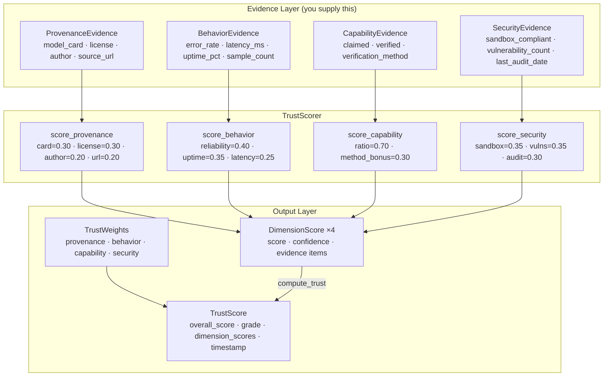

# aumai-trustforge

**Generic trust scoring for AI agents across four independent dimensions.**

Part of the [AumAI](https://github.com/aumai) open-source agentic infrastructure suite.

[](https://github.com/aumai/aumai-trustforge/actions)
[](https://pypi.org/project/aumai-trustforge/)
[](LICENSE)

---

## What is this?

Imagine you are a hiring manager deciding whether to trust a new contractor.
You would not rely on a gut feeling — you would check their references
(provenance), review their track record on recent projects (behavior), verify
that they actually have the skills they claim (capability), and confirm they
passed a background check (security).

`aumai-trustforge` does exactly that for AI agents. Given a structured set of
evidence about an agent, it produces a numeric trust score between 0.0 and 1.0,
broken down across four independent dimensions:

| Dimension | Real-world analogy | What it measures |
|---|---|---|
| **Provenance** | References and credentials | Model card, license, author identity, source URL |
| **Behavior** | Track record on the job | Error rate, average latency, uptime over real traffic |
| **Capability** | Skills test results | Claimed vs. independently verified capabilities |
| **Security** | Background check | Sandbox compliance, known vulnerabilities, audit recency |

The final score is a confidence-weighted combination of all four dimensions. An
agent that is well-documented and fast but ships with 10 unpatched vulnerabilities
will score accordingly — no single dimension can mask a weakness in another.

---

## Why does this matter?

### The problem from first principles

Deploying an AI agent in production is a trust decision. Today that decision is
made informally: a developer reads the model card (if one exists), runs a few
manual tests, and ships. There is no repeatable, auditable, machine-readable
record of why an agent was trusted.

This creates downstream problems:

1. **No regression detection.** When an agent's error rate doubles after a model
   update, there is no prior baseline to compare against.
2. **No cross-team comparability.** Team A's "feels safe" and Team B's "feels
   safe" mean different things and cannot be aggregated.
3. **No compliance evidence.** Auditors cannot inspect a spreadsheet cell that
   says "felt good" and sign off on production use.

`aumai-trustforge` turns a vague, human judgment into a structured, versioned,
serializable artifact with a clear audit trail.

### What this library does NOT do (scope)

This is a scope-reduced (SR-1) library. It intentionally does **not**:

- Propagate trust through agent networks or compute network-aware scores.
- Make deployment decisions — it produces scores, not gate logic.
- Connect to live monitoring systems — you supply the evidence objects.

---

## Architecture



The overall score uses **confidence-weighted aggregation**: each dimension's
contribution is scaled by both its configured weight and its confidence value.
A behavior score derived from 3 samples carries less weight than one derived
from 1,000 samples, automatically.

---

## Features

- **Four independent scoring dimensions** — each with its own evidence model,
  scoring formula, and confidence calculation.
- **Configurable per-dimension weights** — emphasize provenance for compliance
  contexts, or behavior for operational monitoring. Weights must sum to 1.0.
- **Confidence-adjusted aggregation** — low-sample behavior data automatically
  reduces the behavior dimension's influence on the final score.
- **Letter grades** — A/B/C/D/F grading on top of the numeric score for quick
  human consumption.
- **Human-readable evidence items** — every score includes plain-English
  explanations of what drove it up or down.
- **Fully typed Pydantic v2 models** — all inputs and outputs are validated at
  runtime with clear error messages.
- **CLI with text and JSON output** — score agents from shell scripts and CI
  pipelines with no extra code.
- **Minimal dependencies** — only Pydantic and Click. No model loading, no
  network calls, no heavyweight ML frameworks.

---

## Quick Start

### Install

```bash
pip install aumai-trustforge
```

### Score your first agent (Python, under 5 minutes)

```python
import datetime
from aumai_trustforge import (
    TrustScorer, TrustWeights,
    ProvenanceEvidence, BehaviorEvidence,
    CapabilityEvidence, SecurityEvidence,
)

# 1. Configure dimension weights (must sum to 1.0)
weights = TrustWeights(
    provenance=0.30,
    behavior=0.30,
    capability=0.20,
    security=0.20,
)
scorer = TrustScorer(weights)

# 2. Score each dimension with evidence you supply
prov = scorer.score_provenance(ProvenanceEvidence(
    model_card_present=True,
    license_verified=True,
    author_verified=True,
    source_url="https://huggingface.co/my-org/my-agent",
))

behav = scorer.score_behavior(BehaviorEvidence(
    error_rate=0.01,       # 1% error rate
    avg_latency_ms=320.0,  # 320 ms average
    uptime_pct=99.8,       # 99.8% uptime
    sample_count=5000,     # based on 5000 requests
))

cap = scorer.score_capability(CapabilityEvidence(
    claimed_capabilities=["summarize", "translate", "classify"],
    verified_capabilities=["summarize", "translate"],
    verification_method="benchmark_suite",
))

sec = scorer.score_security(SecurityEvidence(
    sandbox_compliant=True,
    vulnerability_count=0,
    last_audit_date=datetime.date.today(),
))

# 3. Compute the overall trust score
trust = scorer.compute_trust(prov, behav, cap, sec, agent_id="my-agent-v2")

print(trust.overall_score)   # 0.8917
print(trust.grade())         # "A"
print(repr(trust))           # TrustScore(agent_id='my-agent-v2', overall_score=0.8917, grade='A')
```

### Score from the CLI (under 5 minutes)

```bash
# 1. Create evidence files for your agent
mkdir agent-evidence

echo '{"model_card_present": true, "license_verified": true, "author_verified": true,
  "source_url": "https://huggingface.co/my-org/my-agent"}' > agent-evidence/provenance.json

echo '{"error_rate": 0.01, "avg_latency_ms": 320, "uptime_pct": 99.8,
  "sample_count": 5000}' > agent-evidence/behavior.json

echo '{"claimed_capabilities": ["summarize", "translate"],
  "verified_capabilities": ["summarize", "translate"],
  "verification_method": "benchmark_suite"}' > agent-evidence/capability.json

echo '{"sandbox_compliant": true, "vulnerability_count": 0,
  "last_audit_date": "2025-12-01"}' > agent-evidence/security.json

# 2. Score with human-readable output
aumai-trustforge score --agent-dir agent-evidence

# 3. Save as JSON for downstream processing
aumai-trustforge score --agent-dir agent-evidence --output json > trust_score.json

# 4. Re-render a saved score later
aumai-trustforge report --input trust_score.json
```

---

## CLI Reference

### `aumai-trustforge score`

Score an agent from evidence files in a directory.

```
Usage: aumai-trustforge score [OPTIONS]

Options:
  --agent-dir PATH      Path to directory containing evidence JSON files.
                        [required]
  --weights FILE        Path to a JSON file with custom TrustWeights.
                        Uses equal weights (0.25 each) when absent.
  --output [text|json]  Output format.  [default: text]
  --agent-id TEXT       Override the agent ID label. Defaults to the
                        name of the agent directory.
  --version             Show the version and exit.
  --help                Show this message and exit.
```

**Evidence files** (place inside `--agent-dir`, all optional):

| Filename | Pydantic model | Purpose |
|---|---|---|
| `provenance.json` | `ProvenanceEvidence` | Model card, license, author, URL |
| `behavior.json` | `BehaviorEvidence` | Operational metrics |
| `capability.json` | `CapabilityEvidence` | Claimed vs. verified capabilities |
| `security.json` | `SecurityEvidence` | Sandbox, vulns, audit date |

Missing files are treated as empty evidence (all-default values, which yield
the lowest possible score for that dimension).

**Custom weights file (`weights.json`)**:
```json
{
  "provenance": 0.30,
  "behavior": 0.30,
  "capability": 0.20,
  "security": 0.20
}
```

**Examples:**
```bash
# Basic text report
aumai-trustforge score --agent-dir ./my-agent

# JSON output, custom weights, custom ID
aumai-trustforge score \
  --agent-dir ./my-agent \
  --weights weights.json \
  --output json \
  --agent-id "prod-summarizer-v3"

# Pipe JSON into jq
aumai-trustforge score --agent-dir ./my-agent --output json | jq '.overall_score'
```

---

### `aumai-trustforge report`

Re-render a previously saved `TrustScore` JSON file without re-running the scoring.

```
Usage: aumai-trustforge report [OPTIONS]

Options:
  --input FILE          Path to a TrustScore JSON file (from 'score --output
                        json').  [required]
  --format [json|text]  Output format.  [default: text]
  --help                Show this message and exit.
```

**Examples:**
```bash
aumai-trustforge report --input trust_score.json
aumai-trustforge report --input trust_score.json --format json
```

---

## Python API Examples

### Accessing per-dimension scores and evidence

```python
for dim_name, dim_score in trust.dimension_scores.items():
    print(f"\n{dim_name.upper()} — score={dim_score.score:.4f}  "
          f"confidence={dim_score.confidence:.2f}")
    for item in dim_score.evidence:
        print(f"  * {item}")
```

### Serializing and deserializing a TrustScore

```python
import json
from aumai_trustforge import TrustScore

# Serialize to JSON
trust_json = json.dumps(trust.model_dump(mode="json"), default=str, indent=2)

# Deserialize from JSON
loaded = TrustScore.model_validate(json.loads(trust_json))
assert loaded.overall_score == trust.overall_score
assert loaded.grade() == trust.grade()
```

### Using equal weights (the default)

```python
from aumai_trustforge import TrustScorer, TrustWeights

# TrustWeights() defaults to 0.25 for each dimension
scorer = TrustScorer(TrustWeights())
```

### Checking the grade thresholds

```python
# Grades map to these overall_score ranges:
# A >= 0.85   B >= 0.70   C >= 0.55   D >= 0.40   F < 0.40
trust.grade()  # returns one of "A", "B", "C", "D", "F"
```

---

## Configuration Reference

### TrustWeights

All four weights must be non-negative and sum to exactly 1.0. The model
validator enforces this with a tolerance of 1e-9 to accommodate IEEE 754
floating-point rounding (e.g., `0.1 + 0.2 + 0.3 + 0.4` is representable
exactly but `0.1 + 0.2 + 0.3 + 0.399...` is not).

```python
# Compliance-heavy: prioritize provenance and security
TrustWeights(provenance=0.40, behavior=0.20, capability=0.20, security=0.20)

# Operations-heavy: emphasize real-time behavior
TrustWeights(provenance=0.15, behavior=0.50, capability=0.15, security=0.20)

# Balanced (default)
TrustWeights()  # 0.25 each
```

### Scoring constants (in `core.py`)

| Constant | Default | Meaning |
|---|---|---|
| `_LATENCY_ACCEPTABLE_MS` | 500 ms | Latency at or below this yields a full latency score of 1.0 |
| `_LATENCY_POOR_MS` | 5000 ms | Latency at or above this yields a latency score of 0.0 |
| `_MIN_SAMPLES_FOR_FULL_CONFIDENCE` | 100 | Sample count for behavior confidence = 1.0 |
| `_AUDIT_ACCEPTABLE_DAYS` | 90 | Audit age in days for full recency score |
| `_AUDIT_MAX_DAYS` | 365 | Audit age in days for zero recency score |

---

## How It Works: Technical Deep-Dive

### Provenance scoring

Four boolean signals with fixed weights summing to 1.0:

```
score = card_present * 0.30
      + license_verified * 0.30
      + author_verified * 0.20
      + (source_url is not None) * 0.20

confidence = 1.0   # booleans have no sampling uncertainty
```

### Behavior scoring

Three continuous sub-scores with fixed weights:

```
reliability = clamp(1.0 - error_rate)                     [weight 0.40]
uptime      = clamp(uptime_pct / 100.0)                   [weight 0.35]
latency     = linear_decay(avg_latency_ms, low=500, high=5000)  [weight 0.25]

score      = reliability*0.40 + uptime*0.35 + latency*0.25
confidence = log(1 + sample_count) / log(1 + 100)
```

The logarithmic confidence scale gives ~50% confidence at 9 samples and
plateaus at 1.0 near 100 samples.

### Capability scoring

```
ratio = |claimed ∩ verified| / |claimed|   [weight 0.70]
bonus = 1.0  if method in {benchmark_suite, automated_eval, automated_benchmark}
      = 0.5  if method in {manual_review, manual}
      = 0.0  otherwise                     [weight 0.30]

score = ratio * 0.70 + bonus * 0.30
```

### Security scoring

```
sandbox = 1.0 if sandbox_compliant else 0.0              [weight 0.35]
vulns   = 1 / (1 + vulnerability_count)                  [weight 0.35]
audit   = linear_decay(age_days, low=90, high=365)       [weight 0.30]

score   = sandbox*0.35 + vulns*0.35 + audit*0.30
```

### Confidence-weighted aggregation

```
effective_weight(dim) = configured_weight(dim) * confidence(dim)
overall = sum(effective_weight * score) / sum(effective_weight)
```

This normalization ensures that a behavior score from 5 samples carries
proportionally less influence than one from 5,000 samples, without the caller
needing to handle this manually.

---

## Integration with Other AumAI Projects

| Project | Integration pattern |
|---|---|
| **aumai-agentci** | Call `TrustScorer` inside a post-run assertion to gate CI on trust thresholds |
| **aumai-capsule** | Attach a `TrustScore` JSON to a `RunCapsule`'s `metadata` field for longitudinal tracking |
| **aumai-specs** | Reference trust score thresholds in agent specification contracts |

---

## Contributing

Contributions are welcome. Please read `CONTRIBUTING.md` before opening a PR.

Key guidelines:
- Python 3.11+, `mypy --strict` must pass.
- All new scoring logic requires unit tests covering typical values, boundary
  conditions, and edge cases (zero samples, all zeros, all ones).
- Do not introduce new external dependencies without discussion — the library
  is intentionally dependency-light.
- Scoring constants in `core.py` are tunable but changes require updated
  documentation and tests.

```bash
git clone https://github.com/aumai/aumai-trustforge
cd aumai-trustforge
pip install -e ".[dev]"
make test   # runs pytest
make lint   # runs ruff + mypy
```

---

## License

Apache License 2.0. See `LICENSE` for the full text.
